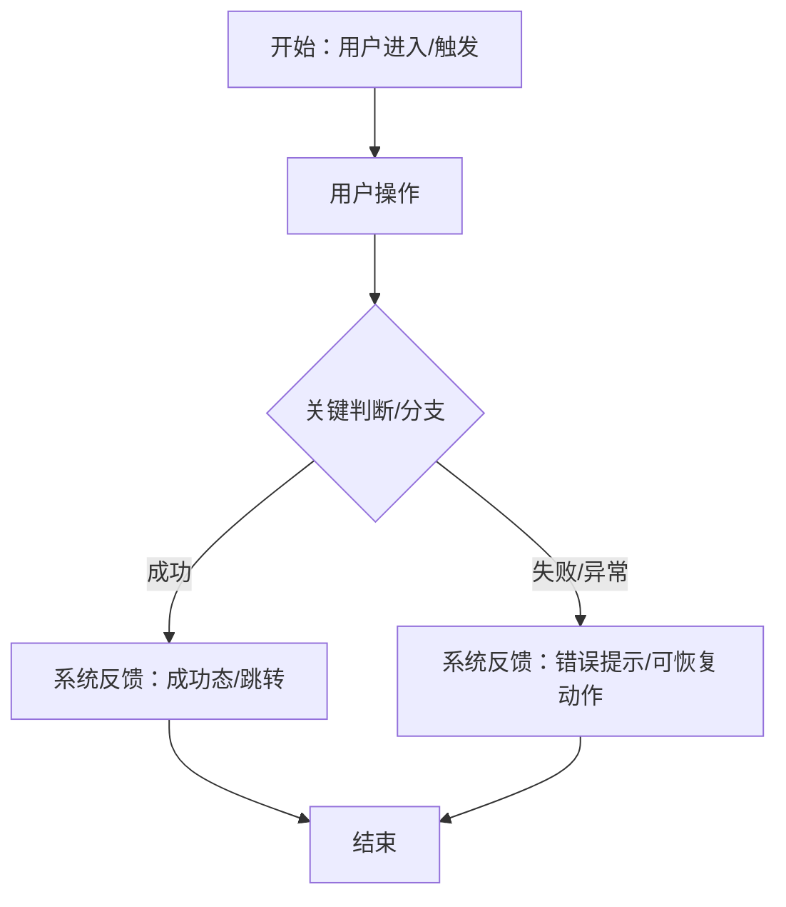
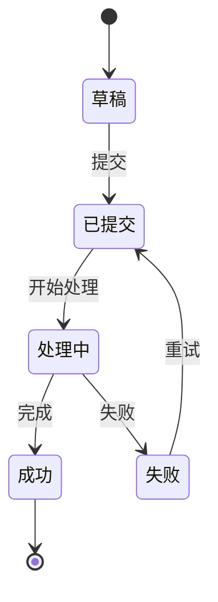

# Proto to PRD — 高保真原型转高细节PRD文档

## 用途

当用户提供高保真原型（设计稿截图、线框图、页面描述、Figma链接描述等），需要将其转换为**高细节、页面结构驱动**的结构化 PRD 文档时调用此技能。

**核心原则：忠实还原原型，不自作主张扩展需求范围。**

### 边界声明

PRD 只负责**用户可见的数据和业务规则**：展示什么、哪些字段必填、用户能做什么。

以下内容**不在本技能范围内**，由下游技能和文档覆盖：
- **开发就绪规格**：业务对象、读写操作、权限范围、刷新时机、成功/失败重试、重复提交、状态恢复等运行时行为
- **接口契约**：字段英文 key、请求/响应结构、错误码、HTTP 状态码
- **技术实现细节**：HTML 属性、CSS 断点、函数名、框架/库名

## 适用场景

- 用户提供设计稿/原型截图，需要生成对应的PRD
- 用户提供页面文字描述或线框图，需要转化为PRD
- 用户提供已有的原型链接和页面说明，需要输出规范PRD
- 用户说"把这个原型转成PRD"、"根据原型写PRD"、"原型转需求文档"等

## 不适用场景

- 从零开始写PRD（使用 `create-prd` 技能）
- 纯需求头脑风暴（使用 `brainstorming` 技能）
- 已有PRD需要评审修改（直接对话即可）
- 生成开发就绪规格或接口契约文档（由下游技能覆盖）

## 执行流程

### Step 1：原型信息采集

1. **识别输入类型**：
   - 图片型：设计稿截图、线框图照片
   - 文本型：页面描述、功能列表、结构说明
   - 混合型：图片+文字说明

2. **提取原型信息**（对图片使用视觉分析，对文本使用结构化解析）：
   - 页面/模块名称及层级关系
   - UI元素清单（按钮、表单、列表、卡片、导航等）
   - 导航结构和页面跳转关系
   - 交互行为（可从设计稿推断的点击、跳转、弹窗等）
   - 数据展示字段（表单字段、列表列、详情字段）
   - 状态和枚举值（按钮状态、标签状态、流程状态）
   - 用户角色（从原型可见的操作和权限差异推断）
   - 业务流程（从页面跳转和交互推断的用户操作流）
   - 异常与边界（原型中展示的空状态、加载态、错误提示）
   - 状态生命周期规则：各类"已完成"状态（草稿、签名、勾选、上传等）在用户回退/重新进入/修改关联数据后的保留或失效规则，以及流程终态（如提交成功）后页面的可操作性（表单锁定还是仍可编辑）。可交互原型（HTML）需读取其交互逻辑获取；静态原型无法判断的列入待确认

3. **信息不足时**：
   - 记录缺失项，在 Step 2 结构确认时一并向用户提出
   - **禁止**：自行编造原型中不存在的信息
   - **禁止**：在用户未确认前继续生成

### Step 2：结构确认（先给结构，确认后再写细节）

在正式生成PRD前，先向用户展示以下结构供确认：

1. **页面/步骤清单**（从原型推断的页面或向导步骤列表；每页分配唯一编号——全局壳 G-XX、独立页面 P-XX、向导步骤 S-XX、弹层/浮层 M-XX（弹窗、抽屉等关键交互视图），编号在 PRD 全文引用）
2. **页面跳转关系**（页面导航地图；区分"原型已实现跳转"与"原型仅示意、未实现跳转"）
3. **每个页面/步骤的目标**（一句话描述该页面的用户目标）
4. **角色与权限矩阵**（从原型推断的角色清单）
5. **信息采集中发现的疑问**（原型中不明确或无法确定的点）
6. **明确排除表**（原型中可见但本期不做、或关联但属于其他文档范围的功能，逐项标注排除原因和后续归属）

用户确认结构后，再进入 Step 3 逐页展开细节。

### Step 3：PRD文档生成

按以下模板生成PRD文档（Markdown格式）：

```markdown
# 产品需求文档：[产品/功能名称] - V[版本号]

## 文档信息
| 项目 | 内容 |
|------|------|
| 文档版本 | v1.0 |
| 创建日期 | YYYY-MM-DD |
| 原型来源 | [原型截图/描述引用] |

> 来源标注统一三档：**原型明确** / **原型明确（mock：写死的编号、日期、演示枚举等，正式产品需替换）** / **推断**。全文各表的"来源"列均适用。

## 1. 综述 (Overview)

### 1.1 项目背景与核心问题
[从原型可推断的业务背景和核心问题，不编造。标注"基于原型推断"或"待确认"]

### 1.2 核心业务流程 / 用户旅程地图
[从原型页面跳转和交互推断的分阶段用户旅程，作为整个文档的目录和主线]

1. **阶段一：[名称]** - [一句话描述该阶段的用户目标]
2. **阶段二：[名称]** - [一句话描述该阶段的用户目标]
...

### 1.3 范围说明
- 本PRD仅覆盖原型中展示的功能
- 原型未涉及的功能不在本PRD范围内

**明确排除表**（每个不做的事项都有原因和去处）

| 排除项 | 排除原因 | 后续归属 |
|--------|----------|----------|
| [功能/内容] | [为什么不在本PRD内] | [对应 Flow / PRD / 开发就绪规格；无既有文档时写"建议立项"] |

### 1.4 Mermaid 图（流程/状态）
> 说明：Mermaid 图用于"需求对齐"，避免歧义。使用用户语言描述（不写 API 路径、HTTP code、函数名、框架/库名等技术实现细节）。单张图建议不超过 15-20 个节点，复杂流程优先分阶段绘制多张图。

#### 1.4.1 用户操作流（必填）
[从原型页面跳转和交互行为提取的完整用户操作流程，含判断分支和异常出口]



#### 1.4.2 状态机（当原型存在明确状态流转对象时必填）
[从原型中可见的状态标签、按钮状态、流程阶段推断的对象生命周期]



**状态变更方表**（状态机存在时必填。只收录业务对象级的状态流转，字段级条件显隐不列入本表。"状态变更方"标注该状态由谁改变：客户 / 系统 / 服务方；混合变更允许同一行标注多方并注明各自职责，如"客户（发起）+ 系统（生成编号）"；静态原型无法判断的标"待确认"）

| 对象 | 状态 | 触发条件 | 用户看到什么 | 用户可执行操作 | 下一结果 | 状态变更方 | 来源 |
|------|------|----------|--------------|----------------|----------|----------|------|
| [业务对象] | [状态] | [触发条件] | [展示内容] | [操作] | [下一状态/结果] | [客户/系统/服务方] | 原型明确/推断 |

## 2. 角色与权限

| 角色 | 说明 | 权限范围 | 来源 |
|------|------|----------|------|
| [从原型可推断的角色] | [说明] | [可见操作] | 原型明确/推断 |

## 3. 页面结构详述

### 3.1 页面清单

| 编号 | 页面/步骤名称 | 页面入口 | 主要目标 | 本期状态 |
|------|--------------|----------|----------|----------|
| G-01 | [全局壳/页面名] | [入口] | [一句话目标] | 做 |

### 3.2 页面整体布局
[描述原型中可见的整体布局结构，如侧边栏+内容区、顶部导航+主区域等]

```text
[ASCII 页面级布局图，标注主要区域划分]
```

### 3.3 全局框架元素
[页面全局共享的元素：TopNav、侧边栏、浮动按钮等，用表格记录]

| 元素 | 类型 | 说明 | 交互行为 |
|------|------|------|----------|
| [元素名] | [按钮/图标/导航等] | [原型中的文字或图标] | [点击/跳转/展开等] |

> 全局约定规则：同一交互约定（如"标准必填提示"）出现 2 次以上时，必须在首次引用处定义其具体表现（提示文案 + 视觉表现），或收进本表统一定义后引用。

---

#### 3.X [编号] [页面/步骤名称]（编号来自 3.1 页面清单，如 3.4 S-01 公司信息）

##### 3.X.1 页面结构
[该页面/步骤的区块划分和布局描述]

```text
[ASCII 区块级布局图]
```

##### 3.X.2 UI元素清单
| 元素 | 类型 | 说明 | 交互行为 |
|------|------|------|----------|
| [元素名] | [按钮/输入框/下拉等] | [原型中的文字或图标] | [点击/跳转/提交等] |

##### 3.X.3 数据字段

**[字段分组名]**

| 字段名 | 类型 | 必填 | 默认值 | 校验规则 | 错误文案 | 来源 |
|--------|------|------|--------|----------|----------|------|
| [字段] | [文本/数字/日期等] | [是/否/条件必填] | [默认值] | [业务语言描述：非空、数字、两位小数、不能为负、邮箱格式等] | [原型中可见的错误提示] | 原型明确/推断 |

> 校验规则用业务语言描述，不写 HTML 属性（如 type=number、step=0.01、min=0）。

##### 3.X.4 交互流程
1. [步骤1：用户操作 → 系统响应，含原型中可见的文案]
2. [步骤2：...]
3. [步骤3：...]

##### 3.X.5 异常与边界
| 异常场景 | 触发条件 | 系统行为 | 提示文案 |
|----------|----------|----------|----------|
| [场景名] | [触发条件] | [字段标记/阻断/提示] | [原型中可见的文案] |

> 仅记录原型中可见或可从交互推断的异常场景。运行时异常（断网重试、幂等、会话恢复等）属于开发就绪规格，不在本PRD范围内。

##### 3.X.6 验收标准
- **场景1: [场景名]**
  - **GIVEN** [上下文/前置条件]
  - **WHEN** [用户执行的动作]
  - **THEN** [期望看到的系统结果，含具体页面状态和文案]

- **场景2: [异常场景名]**
  - **GIVEN** [上下文/前置条件]
  - **WHEN** [用户执行的动作]
  - **THEN** [期望看到的系统结果，含具体提示文案]

##### 3.X.7 线框图
```text
[从原型还原的ASCII线框图，标注关键元素和布局关系]
```

---

（下一个页面/步骤...）

## 4. 非功能需求
- **响应式**：[原型是否有多端适配，用业务语言描述。不写具体断点像素值]
- **用户可见的容量限制**：[如原型文案写了"最多20张"、"单张≤10MB"等用户可见规则]
- **其他**：[原型中可见的非功能信息]
> 标注：原型未涉及的项目标注"待确认"。运行时性能指标（响应时间、并发数等）属于开发就绪规格。

## 5. 待确认事项 (Open Questions)
> 以下内容在原型中无法确认，需要与产品/设计方沟通：

**产品决策待确认**（影响用户可见行为和业务规则）
- [ ] [待确认项：描述 + 为什么需要确认]

**开发就绪规格待补充**（不影响 PRD 交付，但下游需要）
- [ ] [待补充项：描述 + 属于开发就绪规格的哪个维度]

## 6. 决策与确认记录
> 批次确认循环清零时生成：把每个待确认项与用户结论沉淀为决策记录，让后续读者可追溯"为什么这么定"。待确认事项全部清零后本表不允许为空。

| 编号 | 问题 | 确认结论 | 确认日期 | 状态 |
|------|------|----------|----------|------|
| Q-001 | [原待确认项] | [用户确认的结论] | YYYY-MM-DD | 已确认 |

## 7. 变更记录
| 日期 | 版本 | 变更 |
|------|------|------|
| YYYY-MM-DD | v1.0 | 基于原型生成初稿 |
```

### Step 4：一致性自检 + 批次确认循环

#### 4.1 一致性自检

生成PRD后，执行以下自检：

**检查项清单：**

1. **元素覆盖检查**：原型中可见的所有UI元素是否都在PRD中有对应描述？
   - 逐页/逐模块对比
   - 标记遗漏项

2. **交互完整性检查**：原型中可见的交互行为是否都有文档说明？
   - 按钮点击 → 是否有对应流程步骤
   - 页面跳转 → 是否有对应路由说明
   - 表单提交 → 是否有对应数据处理和校验

3. **字段完整性检查**：原型中展示的数据字段是否都已记录？
   - 表单字段（含必填标记、校验规则、错误文案）
   - 列表/表格列
   - 详情页字段

4. **状态覆盖检查**：原型中展示的各种状态是否都已说明？
   - 空状态
   - 加载状态
   - 错误状态
   - 不同业务状态（状态机是否完整）

5. **验收标准覆盖检查**：每个页面/步骤是否至少有成功和失败两条验收路径？
   - Happy Path 场景
   - 至少一个异常场景

6. **范围控制检查**：PRD中是否有原型中不存在的功能？
   - 如发现自行添加的功能 → 删除
   - 如发现推断的功能 → 移至"待确认事项"

7. **边界控制检查**：PRD中是否包含了不属于 PRD 层的内容？
   - 接口字段名（英文 key）→ 移除或标注"属于接口契约"
   - 运行时行为（刷新/幂等/会话恢复/断网重试）→ 移除或标注"属于开发就绪规格"
   - 技术实现细节（HTML 属性、CSS 断点、函数名、框架/库名）→ 移除
   - Mermaid 时序图（App→System→Service 交互）→ 移除，属于开发就绪规格

8. **状态生命周期检查**：各类"已完成"状态（草稿、签名、勾选等）在用户回退/重新进入/修改关联数据后的保留或失效规则、流程终态后页面的可操作性，是否都有文档说明？
   - 原型可判断但未记录 → 补充到对应页面/步骤的交互流程或异常与边界表
   - 原型无法判断 → 移入待确认事项

9. **未定义引用检查**：文档中引用的交互约定（如"标准必填提示"）是否都有定义？
   - 同一约定出现 2 次以上且未定义 → 在首次引用处或全局框架元素表补充定义（提示文案 + 视觉表现）

10. **格式校验与业务风险检查**：
   - 字段表中仅有"非空"校验的格式类字段（邮箱、电话、证件号等）→ 列入待确认：是否需要格式校验
   - 合规/KYC 类产品的身份类规则（如同名成员合并、身份唯一性判定）→ 即使原型有明确定义，也列入待确认并标注业务风险
   - 搜索/联想类组件的匹配规则原型不可见 → 列入待确认

**自检报告格式：**

```markdown
## 自检报告

| 检查项 | 结果 | 详情 |
|--------|------|------|
| 元素覆盖 | 通过/需修正 | [详情] |
| 交互完整性 | 通过/需修正 | [详情] |
| 字段完整性 | 通过/需修正 | [详情] |
| 状态覆盖 | 通过/需修正 | [详情] |
| 验收标准覆盖 | 通过/需修正 | [详情] |
| 范围控制 | 通过/需修正 | [详情] |
| 边界控制 | 通过/需修正 | [详情] |
| 状态生命周期 | 通过/需修正 | [详情] |
| 未定义引用 | 通过/需修正 | [详情] |
| 格式校验与业务风险 | 通过/需修正 | [详情] |
```

如自检发现问题，修正PRD后重新自检，直至全部通过。

#### 4.2 批次确认循环

自检通过后，进入待确认事项的批次确认循环：

1. **提交确认**：将所有"待确认事项"一次性提交给用户，请用户逐条确认或修正
2. **用户回复**：用户逐条回复确认结果
3. **更新PRD**：根据用户回复更新PRD正文
4. **衍生问题检查**：用户回复是否引出了新的需要确认的问题？
   - 有新问题 → 补充到待确认事项，回到步骤1
   - 无新问题 → 进入步骤5
5. **清零确认**：待确认事项全部解决后，将所有问题与用户确认结论转成"决策与确认记录"章节（Q-001 起编号，含确认日期），再输出最终版PRD

**循环规则：**
- 不逐条打断用户，所有疑问一次性提出
- 用户未回复的项保留在待确认事项中，标注"用户暂未确认"
- 循环次数不限，直到待确认事项清零
- 最终输出的PRD中不允许存在未解决的开放问题

### Step 5：输出与保存

1. **输出格式**：Markdown 文档
2. **命名规则**：`PRD-[产品名称].md`
3. **保存位置**：保存到用户的工作目录
4. **输出内容**：PRD正文（待确认事项已清零、决策已沉淀为决策与确认记录、含变更记录）+ 自检报告

## 关键约束

### 必须做到
- **忠实还原**：PRD内容必须与原型一致，原型有什么写什么
- **标注来源**：每个功能点、字段、交互标注其在原型中的对应位置（"来源"列）
- **区分确定与推断**：原型明确展示的 vs 推断的内容必须区分
- **列出待确认**：原型中无法确认的内容列入"待确认事项"，并说明为什么需要确认
- **完整覆盖**：原型中的所有元素、字段、交互都必须有对应文档
- **Mermaid图必填**：用户操作流必填；有状态流转时状态机必填
- **验收标准双路径**：每个页面/步骤至少覆盖成功和失败两条验收路径
- **ASCII线框图**：每个涉及UI的页面/步骤必填线框图
- **状态生命周期**：已完成状态的保留/失效规则、流程终态后页面可操作性必须记录；原型无法判断的列入待确认
- **约定先定义后引用**：重复出现的交互约定必须先定义具体表现（文案+视觉），再统一引用
- **决策沉淀**：待确认清零后必须生成决策与确认记录章节（Q-001 起编号），确认过程不允许直接丢弃
- **结构先行**：先给用户确认结构，再写细节
- **批次确认循环**：待确认事项一次性提交用户，循环修正直到清零
- **业务语言**：校验规则、性能约束等用业务语言描述，不写技术实现细节

### 禁止行为
- **扩展需求**：不得添加原型中不存在的功能或流程
- **编造信息**：不得自行编造原型中不可见的数据、规则、逻辑
- **遗漏元素**：不得忽略原型中可见的任何UI元素或交互
- **模糊描述**：不得用"等"、"可能"、"大概"等模糊表述代替原型中的具体内容
- **跳过自检**：不得在未完成一致性自检前输出最终文档
- **跳过结构确认**：不得在用户确认结构前直接输出完整PRD
- **跳过确认循环**：不得在待确认事项未清零时输出最终文档
- **越界写工程维度**：不得包含接口字段名（英文 key）、运行时行为（刷新/幂等/会话恢复/断网重试）、技术实现细节（HTML 属性、CSS 断点、函数名、框架/库名）
- **技术实现细节**：Mermaid图中不得出现API路径、HTTP code、函数名、框架/库名等技术实现细节
- **时序图**：不得在PRD中生成 Mermaid 时序图（sequenceDiagram），时序图描述的是系统间交互过程，属于开发就绪规格

## 多页面处理

当原型包含多个页面时：
1. 按页面或向导步骤组织结构（而非用户故事）
2. 一个向导步骤可包含多个表单区块（form-block）
3. 先输出页面导航地图（各页面间的关系）供用户确认
4. 逐页/逐步骤生成详细描述
5. 统一自检

## PRD总集（多PRD管理）

当原型较大需要拆分多个PRD时，生成一个PRD总集用于追踪：

```markdown
# PRD 总集

| 版本 | 标题 | 需求内容（详细摘要） | PRD 链接 |
|---|---|---|---|
| PRD-001 | [标题] | [目标+范围+关键约束摘要] | docs/prd/PRD-001.md |
| PRD-002 | [标题] | [目标+范围+关键约束摘要] | docs/prd/PRD-002.md |
```

## 与其他技能的协作

| 场景 | 推荐技能 | 说明 |
|------|----------|------|
| 需求不明确需要头脑风暴 | brainstorming | 先发散需求再转PRD |
| PRD需要导出为Word | docx | 生成PRD后导出 |
| 需要从零写PRD | create-prd | 无原型时的PRD创建 |
| PRD需要做演示文稿 | html-deck | 将PRD转为演示文档 |
| PRD转开发就绪规格 | （下游技能） | 将PRD中的用户可见行为映射为业务对象、读写操作、刷新时机等 |
